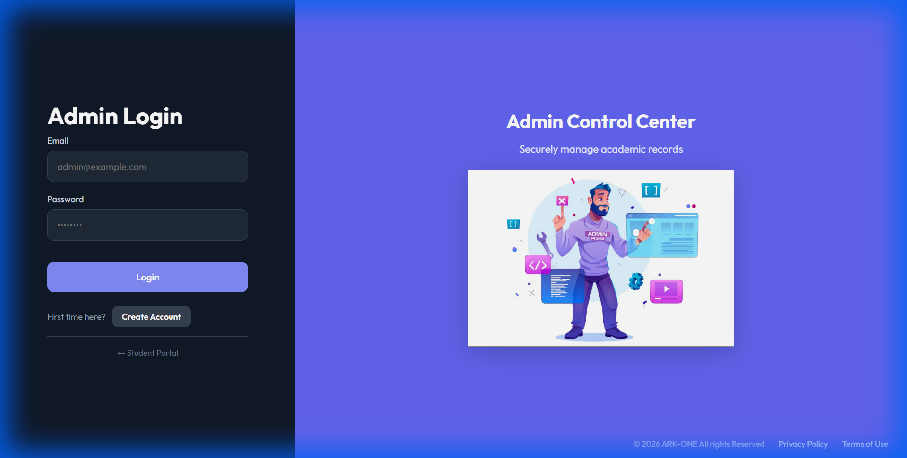
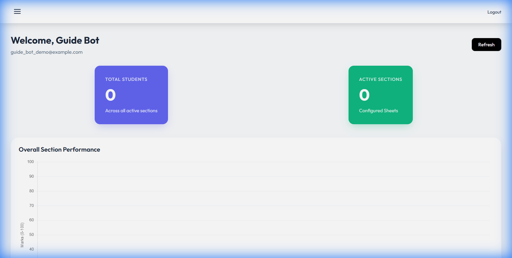
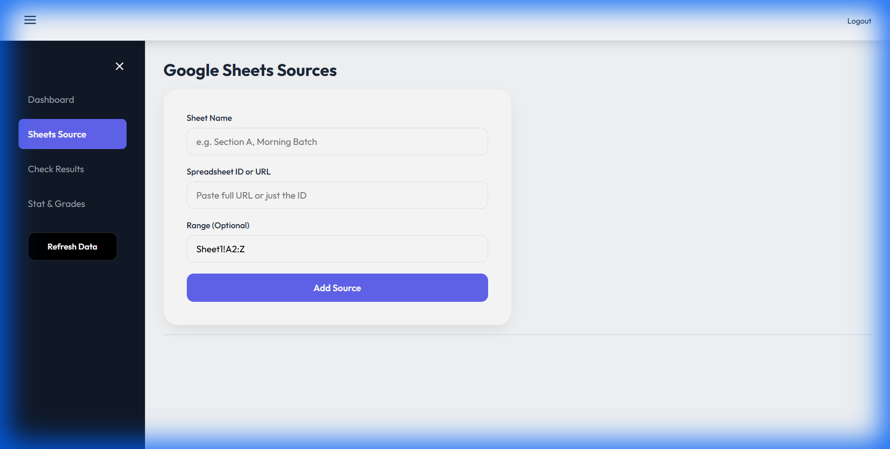
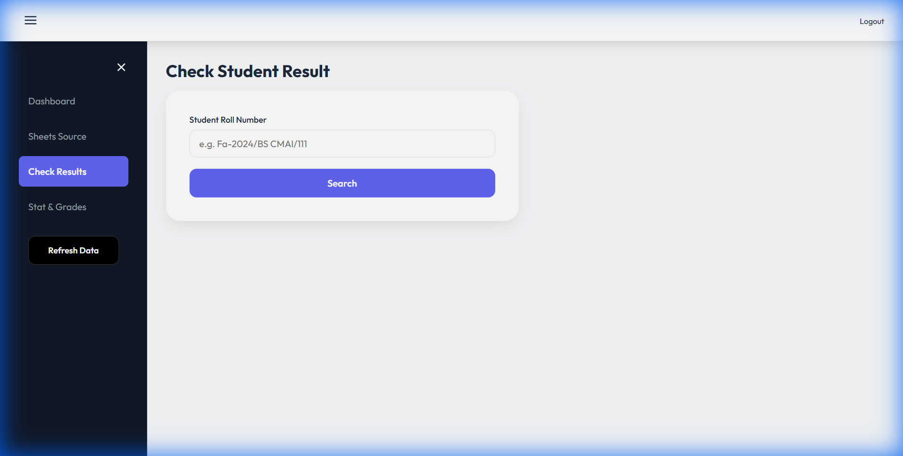
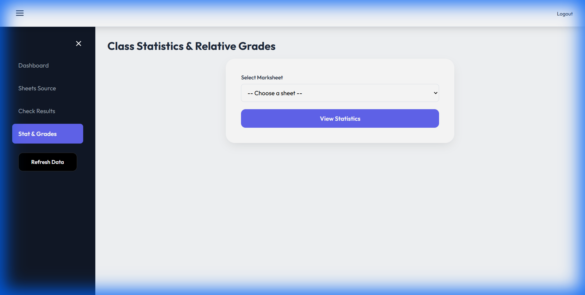

# Student Marks Portal - Admin User Guide

This guide provides a comprehensive walkthrough for administrators to manage the Student Marks Portal. 

## Table of Contents
1. [Accessing the Admin Portal](#1-accessing-the-admin-portal)
2. [Dashboard Overview](#2-dashboard-overview)
3. [Managing Sheet Sources](#3-managing-sheet-sources)
4. [Using Student Results](#4-using-student-results)
5. [Class Statistics & Grading](#5-class-statistics--grading)

---

## 1. Accessing the Admin Portal

To access the administrative panel, navigate to `/admin.html` (e.g., `https://subject-marksportal.vercel.app/admin.html`).

### Login Screen
You will be greeted by the **Admin Login** panel.
- **Login**: Enter your registered Email and Password.
- **Register**: If you are a new admin, click **"Create Account"** to register.
- **Student Portal**: Click "Student Portal" to return to the student login.

---

## 2. Dashboard Overview

After logging in, you will land on the **Admin Control Center**.

### Key Features:
- **Total Students**: A real-time count of all unique students across all linked sheets.
- **Active Sections**: Number of configured subjects/classes.
- **Performance Chart**: A visual line graph showing the marks distribution for each active section.
- **Section Summary Table**: A quick look at Class Average, Highest, and Lowest marks for each subject.

---

## 3. Managing Sheet Sources

The **Sheets Source** tab is the heart of the system. This is where you connect your Google Sheets containing student data.

### 3.1 Adding a New Source
1. **Sheet Name**: Enter a friendly name for the class (e.g., "Computer Science - Fall 2024").
2. **Spreadsheet ID or URL**: Paste the full Google Sheet URL or just the ID.
   - *Note: Ensure your Google Sheet is shared with the Service Account Email provided in your setup.*
3. **Range**: Specify the tab name and range (e.g., `Sheet1!A2:Z`).
   - The first row in your range should contain headers (Roll No, Name, Quiz 1, etc.).
4. Click **Add Source**.

### 3.2 Editing & Deleting
- **Edit**: Click the "Edit" button to modify the range or name.
- **Delete**: Click the "Delete" button (red) to remove a sheet from the portal. **Warning**: This cannot be undone.
- **Open**: Click "Open ↗" to view the actual Google Sheet in a new tab.

---

## 4. Using Student Results

The **Student Results** tab allows you to perform a quick lookup for any individual student.

1. enter the **Roll Number** (exact match required).
2. Click **Search**.
3. The system will display the student's marks across all subjects found in the linked sheets.

---

## 5. Class Statistics & Grading

The **Class Statistics** tab provides deep insights and grading automation.

### 5.1 Viewing Reports
1. **Select a Marksheet**: Choose one of your linked sheets from the dropdown.
2. The page will load the full class report, including:
   - **Bell Curve**: A graph showing grade distribution (A+, A, B, etc.).
   - **Summary Cards**: Average, Highest, Lowest stats for this specific sheet.
   - **Detailed Table**: A list of all students with their Marks, Percentage, and calculated Grade.

### 5.2 Grading Logic
The system supports multiple grading modes:
- **Automatic (Relative Grading)**: Grades are assigned based on a curve/percentile (Top 15% get A, etc.).
- **Percentage Based**: (Optional) Assign grades based on fixed percentage thresholds.
- **Manual Overrides**: You can manually edit a grade for a specific student if needed.

### 5.3 Export
- Click **"Export CSV"** to download the analysis for your records.

---

## Support
If you encounter any issues or need to reset the system cache, use the **"Refresh Data"** button in the sidebar to force a re-sync with Google Sheets.
